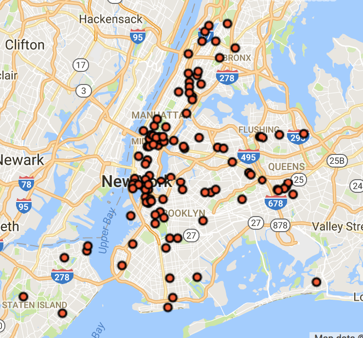
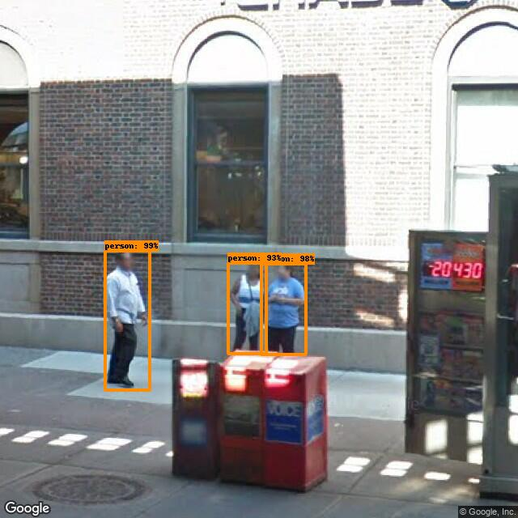

nyc_ped_count_cnn
==============================

This project explores the possiblity of using Google Street View -> Object Detection with CNN 
as a quick alternative way of measuring pedestrian volume in a city.

## Overview

1. Collecting panoramic street views (Google Street View API) 
2. Object Detection with Faster-RCNN with PyTorch
3. Evaluation with NYC Pedestrian Data

## NYC Bi-Annual Citywide Pedestrian Counts
- Collected by human agents from 114 locations in May & September
- Midweek(7-9am, 4-7pm) and adjacent Saturday (12-2pm)
- http://www.nyc.gov/html/dot/html/about/datafeeds.shtml#Pedestrians

## Collecting Google Street View
- collected 18 GSVs per location (total 18 * 114 = 2052 images)
- used [streetscape](https://github.com/yonghah/streetscape)
- See my Jupyter notebook for the details: https://github.com/yonghah/nyc_ped_count_cnn/blob/master/notebooks/01-Get-Street-Views-NYC.ipynb

## Pedestrian Detection
- Faster-RCNN with PyTorch
- Processed on 1080Ti (< 10 min)
- See my Jupyter notebook for the details: https://github.com/yonghah/nyc_ped_count_cnn/blob/master/notebooks/02-detect-pedestrians-pytorch.ipynb

## Data Clean Up
https://nbviewer.jupyter.org/github/yonghah/nyc_ped_count_cnn/blob/master/notebooks/03-dataset-cleaning.ipynb

## Compare two estimations
- See my Jupyter notebook for the details:https://nbviewer.jupyter.org/github/yonghah/nyc_ped_count_cnn/blob/master/notebooks/04-Compare-two-datasets.ipynb
