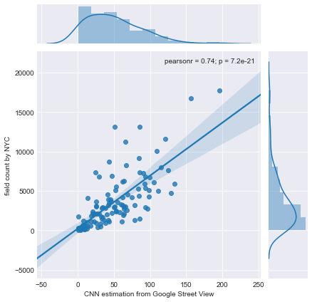

nyc_ped_count_cnn
==============================

This project explores the possiblity of using Google Street View -> Object Detection with CNN 
as a quick alternative way of measuring pedestrian volume in a city.

## Overview

1. Collecting panoramic street views (Google Street View API) 
2. Object Detection with Faster-RCNN (Google Object Detection API)
3. Evaluation with NYC Pedestrian Data

## NYC Bi-Annual Citywide Pedestrian Counts
- Collected by human agents from 114 locations in May & September
- Midweek(7-9am, 4-7pm) and adjacent Saturday (12-2pm)
- http://www.nyc.gov/html/dot/html/about/datafeeds.shtml#Pedestrians

## Collecting Google Street View
- collected 18 GSVs per location (total 18 * 114 = 2052 images)
- used [streetscape](https://github.com/yonghah/streetscape)

## Pedestrian Detection
- [Google Object Detection API](https://github.com/tensorflow/models/tree/master/research/object_detection) is used.
- Processed on Amazon AWS p2.xlarge (~30 min)

## Compare two estimations

r=0.72
