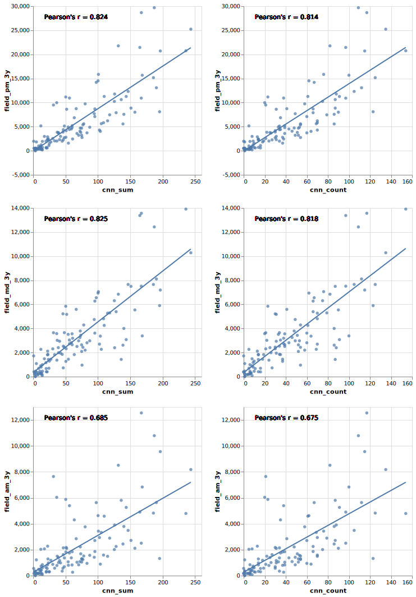

# 연구의 방법

이 연구에서는 컴퓨터 비전의 한 기법인 객체 탐지(objection detection)를 거리의 한 지점 내의 눈높이 위치에서 360도로 촬영한 거리 파노라마 영상(Panoramic Street View, PSV)에 적용하여 PSV 이미지 속의 보행자를 검출해내고 이를 이용하여 보행량을 추산한다. 이러한 추산의 유효성을 검증하기 위해 조사원이 직접 현장조사를 통해 얻어낸 보행량 자료와 비교한다.

## 데이터의 수집

현장조사 보행량 자료로는 뉴욕시 교통국(Department of Transportation, City of New York)의 반기별 보행량 집계(Bi-Annual Pedestrian Counts)를 이용한다. 이 조사에서 뉴욕시는 관내의 114개소에 대해 1년에 두 차례, 5월과 9월, 보행량 조사를 실시한다. 매 반기의 조사마다 1개소에 대해 3개의 시간대의 보행량을 집계한다. 이중 2개의 시간대는 주중(화요일, 수요일, 목요일 중 택일)으로 첫번째 시간대로는 오전 7시부터 오전 9시 사이의 보행자수를 집계하고, 두번째 시간대로는 오후 4시부터 오후 7시 사이의 보행자수를 집계한다. 그리고 마지막 세번째로는 토요일 정오부터 오후 2시까지의 보행자수를 집계한다. 2020년 3월 현재 2007년 5월부터 2019년 5월까지의 데이터가 공개되어 있지만 2019년 집계는 아직 결측치가 많아 제외하였다. 또한 파노라마 영상이 주로 2018년과 2019년에 측정되었기 때문에, 이와 가까운 2016년 5월부터 2018년 9월까지 3개년 6회 측정분을 이용하였다.

위의 반기별 보행량 조사가 수행되는 114개 측정 지점에 대해 거리 파노라마 영상을 수집하였다. 가장 범용적으로 이용되는 거리 파노라마 영상인 구글 스트릿 뷰(Google Street View)를 Google Maps API를 이용하여 수집하였다. 1개소의 360도 파노라마 영상을 600픽셀의 정방형 이미지 18장으로 분할하였다. 이미지들의 메타데이터를 수집한 결과, 114개 파노라마 영상 중 73개가 2019년에 촬영되었고, 27개가 2018년에 나머지 14개가 그 이전에 촬영되었음을 알 수 있었다.

객체 탐지를 위해 이 연구는 Ren 등(2015)의 Faster-RCNN을 사용한다. 이 방법은 딥 컨볼루션 뉴럴넷(deep convolutional neural network)을 이용한 방법으로서  Yin등의 선행연구(2015)에서 사용된 ACF(Aggregated Channel Features)보다 더 좋은 성능을 가지는 것으로 알려져 있다 (Zhang et al. 2016). 구체적으로는 ResNet-50 구조(He et al. 2016)를 인간을 포함한 81개의 객체 종류를 가진 COCO datatset(Lin et a. 2014)에 대해 이미 훈련된 신경망(pre-trained network)을 이용하여 객체 탐지를 수행하였다. 1개의 NVidia 1080 Ti GPU를 이용하여 총 2052장(114개소X18장)의 수집된 이미지에 대해 Faster-RCNN을 실행하였다. 실행의 결과로, '인간'(COCO의 'person' 범주)으로 판별된 객체들과 그 판별 확률을 수집하였다. 

## 상관관계의 분석

현장조사 보행량과 객체 탐지 보행량을 비교하기 위해 변수를 생성하였다. 현장조사 보행량은 3년 평균 오전 측정치(field_am_3y), 3년 평균 오후 측정치(field_pm_3y), 3년 평균 주말 측정치(field_md_3y)를 사용한다. 시간대별로 상관관계가 달라지는지 알아보는 것이 목적이다. 

객체 탐지 보행량 변수를 위해 두 가지의 상이한 집계 방식을 이용한다. 집계 방식에 따라 유의미한 차이가 있는지 확인하는 것이 목적이다. 첫번째 방식은 보행량 조사 개소에 대해 판별 확률이 일정 문턱 값 이상인 탐지된 객체 숫자를 세는 것이고(cnn_count), 두번째 방식은 보행량 조사 개소에 대해 판별 확률을 모두 더하는 것이다(cnn_sum).  

3가지의 현장 조사 보행량 변수와 2가지의 객체 탐지 보행량 변수의 6가지 조합들에 대해 상관 계수(Pearson's correlation coefficient)를 계산하여 비교한다.

# 결과

딥러닝 객체 탐지를 이용한 보행량 추산은 현장 조사를 통한 보행량 집계와 높은 수준의 상관관계를 보인다. 특히 오후 시간대와 주말 낮 시간대의 보행량 집계와는 0.8 이상의 상관관계를 보이고 있다. 출근 시간대인 주중 오전 시간의 보행량과는 다소 차이가 있다. 적어도 이 연구에서 이용된 데이터셋에 대해서는 탐지된 객체의 집계 방식은 현장 조사와의 관계를 보는데 있어 큰 영향을 미치지 않는다.

# Reference

Yin, Li, et al. "‘Big data’ for pedestrian volume: Exploring the use of Google Street View images for pedestrian counts." *Applied Geography* 63 (2015): 337-345.

Zhang, Liliang, et al. "Is faster r-cnn doing well for pedestrian detection?." *European Conference on Computer Vision*. Springer International Publishing, 2016.

Ren, Shaoqing, et al. "Faster R-CNN: Towards real-time object detection with region proposal networks." *Advances in neural information processing systems*. 2015.

He, Kaiming, et al. "Deep residual learning for image recognition." *Proceedings of the IEEE conference on computer vision and pattern recognition*. 2016.

Lin, Tsung-Yi, et al. "Microsoft coco: Common objects in context." *European conference on computer vision*. Springer, Cham, 2014.